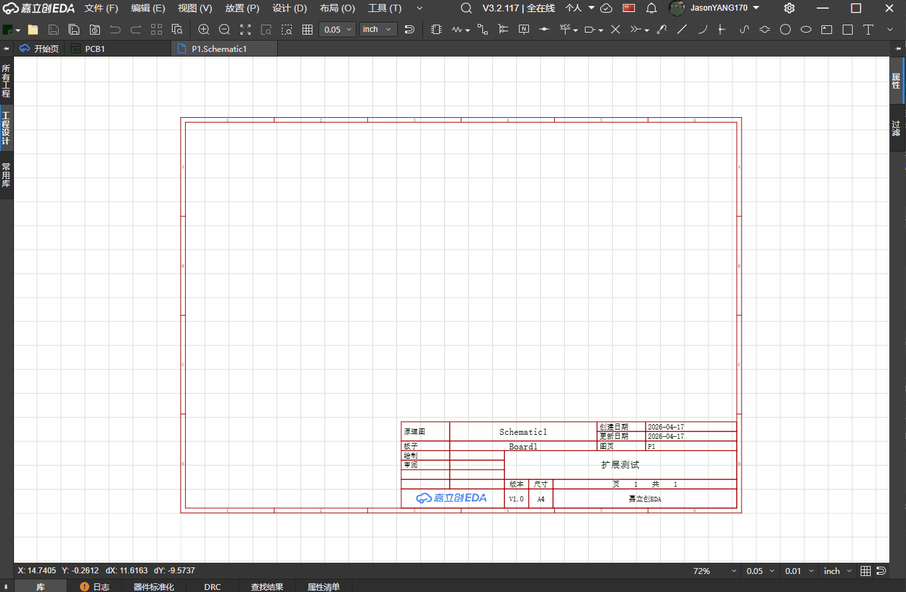
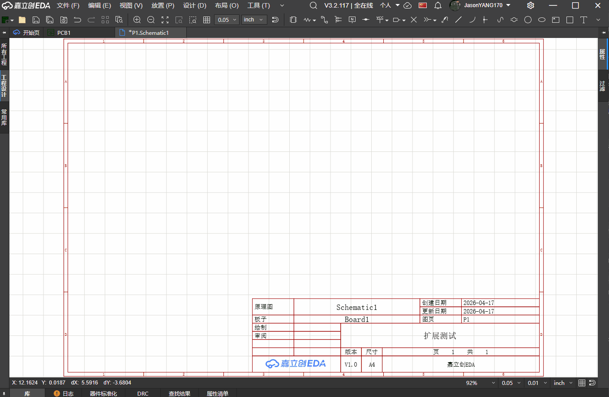

# CircuitJS1仿真器

在嘉立创EDA专业版中嵌入的本地CircuitJS1电路仿真器。

## 支持功能

### ✅内嵌 CircuitJS1 仿真器

可直接在嘉立创EDA中本地运行CircuitJS1仿真，无需联网

### ✅一键导出到嘉立创EDA

**BETA:此功能暂不支持复杂仿真**

CircuitJS1菜单栏点击"导出到嘉立创EDA"，即可自动在原理图中放置对应元件和导线

- 元件引脚自动补偿导线连接
  - 电源轨（VCC）和地（GND）自动创建网络标志

## 参考

- 致谢作者 [pfalstad/circuitjs1](https://github.com/pfalstad/circuitjs1) & [sharpie7/circuitjs1](https://github.com/sharpie7/circuitjs1)
- [easyeda/circuitjs1-easyeda](https://github.com/easyeda/circuitjs1-easyeda)
